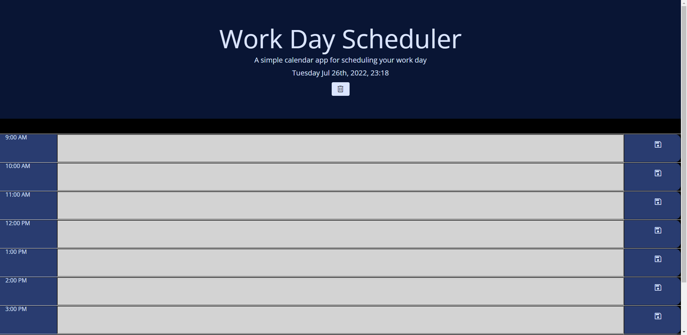

# Single Workday Planner

This simple planner allows you to make a schedule for a single workday and focus more on the things that need to be done.  All events are stored on your local machine.  The events are also color coded based on past, present, and future times.

## [Live site](https://relentlessnc.github.io/Single_Workday_Planner/)

## Technologies Used

- HTML
- [Bootstrap](https://getbootstrap.com/)
- CSS
- JavaScript
- [JQuery](https://jquery.com/)
- [momentJS](https://momentjs.com/)
- [google fonts](https://fonts.google.com/icons)
- [font awesome](https://fontawesome.com/)

## Sample Image

